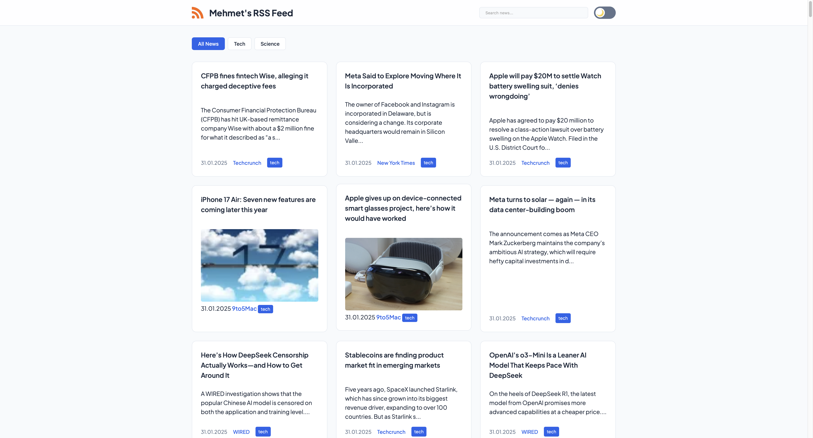
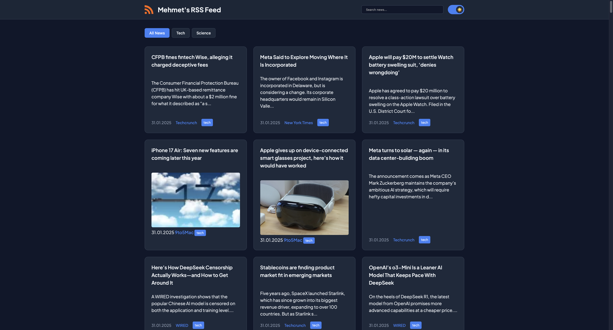

# 📰 Modern RSS Feed Reader

  

  
  
  

## 📖 Project Description

A modern, lightning-fast RSS feed aggregator built with vanilla JavaScript. This application fetches and combines multiple RSS feeds into a unified, beautiful interface with real-time updates. Features an intelligent caching system, multiple CORS proxy support, and a responsive glass-morphism design.

### Live Demo: [Website](https://mehmetkahya0.github.io/rss/) 

### Key Highlights:
- **Smart Caching**: Implements local storage with intelligent cache invalidation
- **Fault Tolerant**: Multiple proxy fallbacks ensure reliable feed fetching
- **Performant**: Vanilla JS implementation with zero dependencies
- **Accessible**: Semantic HTML and keyboard navigation support
- **Modern UI**: Glass-morphism design with smooth animations

## 🌟 Features

- 🔄 Real-time RSS feed aggregation
- 🌓 Dark/Light theme support
- 🔍 Search functionality
- 📱 Responsive design
- 🏷️ Category filtering
- ⚡ Fast loading with caching
- 🌐 CORS-friendly with multiple proxy support
- 🎨 Modern glass-morphism UI

## 🚀 Quick Start

1. Clone the repository:
2. Open the `index.html` file in your web browser to view the news website.
3. Click on the article titles to access the corresponding news details.
4. If you access the site from a mobile device, you'll see a warning not to display news images.
5. Click on the "Feedback" button to send feedback via email.

## 🛠️ Technologies & Architecture

### Core Technologies
- **HTML5**
  - Semantic markup
  - Web Storage API
  - DOM API
  
- **CSS3**
  - CSS Variables for theming
  - Glass-morphism effects
  - CSS Grid & Flexbox
  - CSS Animations
  - Media Queries
  
- **JavaScript (ES6+)**
  - Async/Await
  - DOM Manipulation
  - localStorage API
  - Fetch API
  - XML/RSS Parsing
  
### Development Tools
- **Version Control**: Git
- **Code Quality**: ESLint
- **Performance**: Lighthouse Audits
- **Deployment**: GitHub Pages

### Architecture Highlights

## 📸 Screenshots

  <table>
    <tr>
      <td align="center">
        
         
        <em>Light Mode</em>
      </td>
      <td align="center">
        
         
        <em>Dark Mode</em>
      </td>
    </tr>
  </table>

## Contribution

If you would like to contribute to the project, please open a "Pull Request." For significant changes, remember to discuss them in the "Discussions" section first.

## License

This project is licensed under the MIT License. For more information, please refer to the [LICENSE](LICENSE) file.
